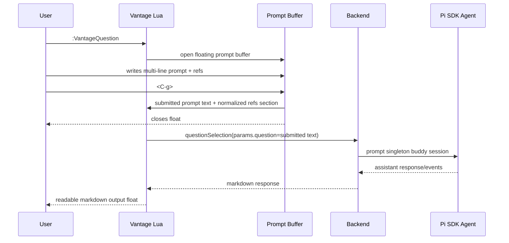
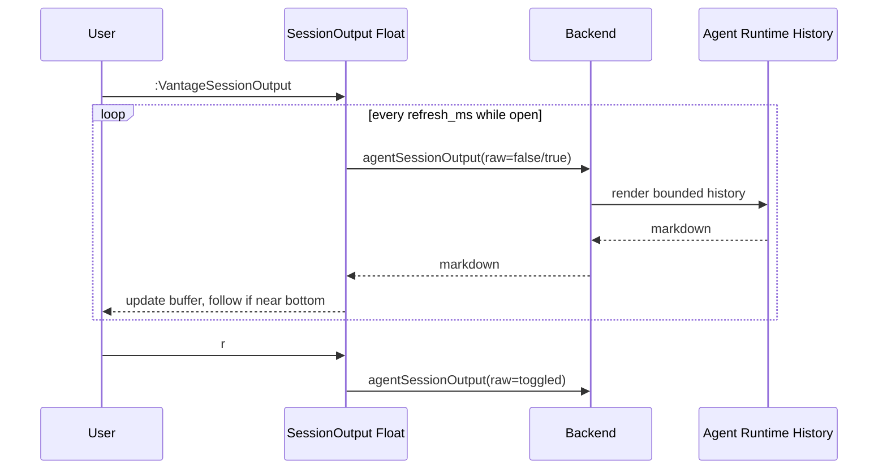

# Prompt Authoring, Output Polish, and Session Output Design

Status: draft for user review  
Created: 2026-06-12

## Goal

Implement three near-term Vantage usability improvements as one coherent slice:

1. A PromptBuilder-style floating prompt authoring buffer for commands that need user-authored prompts.
2. A shared, more readable markdown output float used by Explain and other markdown output commands.
3. A live-updating `:VantageSessionOutput` command that shows recent agent/session activity in chronological order, similar in spirit to Pi TUI output.

The implementation should preserve Vantage's core product constraints:

- model/agent calls remain explicit;
- Vantage remains a Neovim buddy, not an autonomous coding replacement;
- annotations do not pollute singleton buddy session memory;
- Pi owns agent/session/skill semantics where possible;
- optional completion integrations must not make `blink.cmp` or `nvim-cmp` required dependencies.

## Non-Goals

- No session resume/persistence in this slice.
- No shared live session with Pi TUI/tmux in this slice.
- No custom completion popup/typeahead engine.
- No full file-content or skill-content prompt expansion.
- No split-window display strategy for output or prompt authoring.
- No automatic mutation of user completion-plugin configuration.

## Locked Decisions

### Implementation sequence

Use the output-first sequence:

1. Build a shared markdown float output primitive.
2. Apply it to `VantageExplain` and all markdown output.
3. Add backend session-output history and `VantageSessionOutput` live view.
4. Add prompt authoring float and optional completion integrations.

### Markdown output

- Always use a floating buffer.
- Add minimal readability config only.
- One reusable markdown output primitive applies to all markdown-ish Vantage output: explain, question, status, errors, no-annotation messages, agent reset/cancel, and future session output.
- Defaults should be polished without requiring user configuration.

Suggested config:

```lua
require("vantage").setup({
  ui = {
    output = {
      width = 0.82,      -- fraction of editor columns, or integer columns
      height = 0.72,     -- fraction of editor rows, or integer rows
      border = "rounded",
      wrap = true,
    },
  },
})
```

### Prompt authoring

- Use a floating editable prompt buffer.
- Open it only when a command needs prompt text and no inline command args were provided.
- Applies to:
  - `:VantageQuestion` with no args
  - `:VantageEdit` with no args
  - `:VantageSearch` with no args
- Inline args continue to run immediately.
- `:VantageExplain` remains direct and does not open a prompt buffer.
- Prompt buffer submit closes/wipes immediately. No draft recovery in v1.
- Default keymaps:
  - submit: `<C-g>` in normal/insert mode
  - cancel: `<Esc>`
- Prompt keymaps are configurable.

Suggested config:

```lua
require("vantage").setup({
  ui = {
    prompt = {
      keymaps = {
        submit = "<C-g>",
        cancel = "<Esc>",
      },
    },
  },
})
```

### Prompt references

Prompt buffer text is preserved. Vantage appends a small normalized references section when it recognizes references.

- `@file` references are workspace-root-relative.
- Known `@file` references resolve to normalized file path metadata only. They do not expand to file contents.
- Unknown `@file` references remain literal text.
- `/skill-name` references resolve through Pi-owned skill discovery.
- Known `/skill-name` references become `skill:<skill_name>` metadata only. They do not expand to full skill content.
- Unknown `/skill-name` references remain literal text.
- No preflight failure for unresolved references in v1.

Conceptual submission shape:

```md
Please explain how this relates to @lua/vantage/ui.lua

Use /effect-ts thinking if relevant.

## Vantage Prompt References

- file: `lua/vantage/ui.lua`
- skill: `skill:effect-ts`
```

### Completion integrations

- Vantage must not implement its own completion UI engine.
- Prompt buffers work without completion.
- Completion is opt-in through explicit integration helpers.
- Supported optional integrations:
  - `require("vantage.integrations.blink").setup()`
  - `require("vantage.integrations.cmp").setup()`
- If no supported completion plugin is installed/configured, Vantage provides no prompt-buffer autocomplete.
- For `@file`, prefer existing path/file completion behavior from the completion plugin where possible. Vantage should mark prompt buffers with buffer-local metadata/filetype so users/integrations can scope path completion to prompt buffers.
- For `/skill`, Vantage may provide a small completion source adapter because the source is Vantage/Pi-specific, but the popup/menu is owned by blink/cmp.
- Integration helpers are explicit opt-in only. Vantage will not auto-register blink/cmp sources just because the plugin is installed.

### Pi-owned skill discovery

Vantage should not reimplement Pi skill-discovery rules in Lua. Add a backend method, tentatively `listSkills`, that uses Pi SDK resource discovery.

Pi SDK exposes relevant primitives such as:

- `DefaultResourceLoader.getSkills()`
- `loadSkills(...)`
- `loadSkillsFromDir(...)`
- `SettingsManager.getSkillPaths()`

Backend response shape should be small and stable:

```ts
type ListSkillsResult = {
  kind: "skills";
  skills: Array<{
    name: string;
    description: string;
    filePath: string;
    source?: string;
  }>;
  diagnostics?: Array<{ message: string; severity?: string }>;
};
```

Lua completion adapters should cache this list briefly and degrade gracefully to no `/skill` completions if the backend call fails.

### Session output

Add `:VantageSessionOutput` and public Lua API:

```lua
require("vantage").session_output()
```

Behavior:

- Opens a floating read-only markdown buffer.
- Shows bounded recent activity in chronological order, latest at bottom.
- Focus/cursor starts at the bottom when opened.
- While open, polls backend snapshots and updates live.
- Auto-follows new output only when the user is at or near the bottom; if the user scrolls up, do not force-scroll.
- Includes singleton buddy session requests and annotation activity.
- Annotation entries are clearly marked transient and must not be added to buddy memory.
- `VantageAgentReset` clears all session-output history.
- Cancelled requests remain visible as cancelled entries.

Default keymaps:

- `q`: close output float
- `r`: toggle curated/raw detail mode

Keymaps are configurable:

```lua
require("vantage").setup({
  ui = {
    session_output = {
      refresh_ms = 750,
      keymaps = {
        close = "q",
        toggle_raw = "r",
      },
    },
  },
})
```

Retention is backend-owned:

```lua
require("vantage").setup({
  agent = {
    session_output = {
      history_limit = 10,
    },
  },
})
```

The backend method, tentatively `agentSessionOutput`, returns pre-rendered markdown:

```ts
type AgentSessionOutputParams = BaseRequestParams & {
  raw?: boolean;
};

type AgentSessionOutputResult = {
  kind: "explanation";
  markdown: string;
};
```

Lua controls the float, polling, raw toggle, and follow behavior. Backend controls event capture, bounded retention, and markdown rendering.

## Architecture

### Lua modules

#### `lua/vantage/ui.lua`

Refactor into a shared float helper plus markdown display behavior.

Responsibilities:

- compute float dimensions from `ui.output` config;
- support fractional or absolute width/height;
- create floating windows with consistent border/style;
- render read-only markdown buffers;
- set readability options:
  - `filetype=markdown`
  - `wrap`
  - `linebreak`
  - appropriate `breakindent`
  - no swapfile
  - `bufhidden=wipe`
- keep existing `last_float_buf()` test helper working;
- optionally expose an internal helper for editable floats used by prompt/session modules.

#### `lua/vantage/prompt_buffer.lua`

New module for editable prompt authoring.

Responsibilities:

- create a floating markdown buffer;
- set buffer markers such as `b:vantage_prompt_buffer = true` and command kind metadata;
- apply configurable submit/cancel keymaps;
- start in insert mode;
- collect text on submit;
- normalize recognized references;
- append normalized references section;
- call a supplied callback with final prompt text;
- wipe/close immediately after submit or cancel.

It should not know how to call the backend directly. `model_command.lua` passes command-specific callbacks.

#### `lua/vantage/model_command.lua`

Change missing-prompt flows for `question`, `edit`, and `search`:

- if inline args exist, keep current behavior;
- if no inline args, open `prompt_buffer`;
- on submit, call the existing request functions with the submitted text;
- search range and visual behavior require an explicit prompt. When a range is supplied and no args exist, open the prompt buffer instead of using a default prompt.

#### `lua/vantage/session_output.lua`

New module for the live session output float.

Responsibilities:

- open/read-only markdown float;
- poll `agentSessionOutput` while visible;
- track raw/curated mode;
- apply configurable `q` and `r` keymaps;
- update buffer contents without stealing focus unnecessarily;
- jump to bottom on open;
- auto-follow only if near bottom;
- stop polling when buffer/window closes.

#### `lua/vantage/integrations/blink.lua`

Optional helper. It should be safe to require even when blink is missing, returning a readable error or no-op failure.

Responsibilities:

- register/scaffold Vantage prompt-buffer completion integration for blink;
- expose `/skill` completion using backend `listSkills`;
- document how to enable existing path/file completion for `@file` in Vantage prompt buffers;
- avoid auto-mutating user config outside the explicit setup call.

#### `lua/vantage/integrations/cmp.lua`

Same intent as blink helper for nvim-cmp.

### Backend TypeScript

#### Protocol

Add methods:

- `listSkills`
- `agentSessionOutput`

Add result/param types:

- `ListSkillsResult`
- `SkillSummary`
- `AgentSessionOutputParams` if raw flag is modeled separately

#### Agent runtime interface

Extend `AgentRuntime` with:

```ts
listSkills(params: BaseRequestParams, context?: AgentRuntimeRequestContext): AgentRuntimeResult<ListSkillsResult>;
agentSessionOutput(params: AgentSessionOutputParams, context?: AgentRuntimeRequestContext): AgentRuntimeResult<ExplanationResult>;
```

Development and legacy runtimes should implement deterministic/simple responses for tests.

#### Coding agent runtime

Add bounded in-memory activity history to `CodingAgentSessionStore` or a neighboring recorder.

Record entries for:

- `explain`
- `question`
- `edit`
- `search`
- `annotate` as transient
- cancel status updates
- errors

Each entry should contain enough data to render curated and raw views:

```ts
type SessionOutputEntry = {
  id: string;
  kind: "explain" | "question" | "edit" | "search" | "annotate";
  transient: boolean;
  status: "running" | "completed" | "failed" | "cancelled";
  startedAt: number;
  endedAt?: number;
  provider: string;
  model: string;
  userSummary: string;
  prompt: string;
  assistantText?: string;
  events: Array<{
    time: number;
    type: string;
    summary: string;
    details?: unknown;
  }>;
  error?: string;
};
```

History limit comes from agent config, e.g. `agent.session_output.history_limit`, with default 10.

`agentSessionOutput({ raw })` renders chronological markdown. Curated mode should summarize prompt and events; raw mode should include full prompt and fuller event details.

`agentSessionReset` should clear both the singleton buddy session and this output history.

`agentCancel` should update the active entry to cancelled when applicable.

#### Skill listing

Use Pi SDK skill/resource loading rather than Lua filesystem scanning. Preferred path:

1. Create or use `SettingsManager`/`DefaultResourceLoader` for the workspace.
2. Call `getSkills()`.
3. Return names/descriptions/file paths/source info/diagnostics.

If the Pi resource loader requires project trust semantics, Vantage should follow the SDK default and report diagnostics rather than bypassing it.

## Data Flow

### Missing-prompt command flow



### Session output flow



## Error Handling

- Prompt submit with empty/whitespace-only text should warn and keep the prompt buffer open.
- Prompt cancel closes without making a backend request.
- Unknown prompt references remain literal and do not error.
- `listSkills` backend failure should not break prompt buffers. Completion should show no skill items and optionally notify once at debug/warn level.
- `agentSessionOutput` backend failure should render a readable error markdown in the session output float and keep polling unless the backend exits permanently.
- Poll timers must stop when the session output window or buffer closes.
- Raw toggle should preserve scroll/follow behavior.
- Reset while an agent request is active should keep existing reset semantics: reject reset and ask user to cancel first. If reset succeeds, clear output history.

## Testing Plan

### Lua tests

- `ui.show_markdown` applies readable float options: markdown filetype, wrap/linebreak, configured dimensions.
- `VantageExplain` still opens markdown output for current line/range.
- `VantageStatus` still uses the shared output primitive.
- Missing-arg `VantageQuestion` opens prompt buffer instead of `vim.ui.input`.
- Missing-arg `VantageEdit` opens prompt buffer and applies submitted edit.
- Missing-arg `VantageSearch` opens prompt buffer, except preserve existing range default-prompt behavior if current tests require it.
- Prompt buffer submit uses `<C-g>`, cancel uses `<Esc>`, both configurable.
- Prompt references append normalized section for recognized `@file` and `/skill` refs.
- Unknown refs remain literal.
- `VantageSessionOutput` command exists and public Lua API calls it.
- Session output opens at bottom.
- `r` toggles raw mode.
- `q` closes.
- Polling stops after close.

### Backend tests

- Protocol parser accepts `listSkills` and `agentSessionOutput`.
- Development runtime returns deterministic skill and session output responses.
- Coding runtime records completed explain/question/search/edit entries.
- Coding runtime records annotation entries as transient without adding them to buddy memory.
- Cancelled request is rendered as cancelled.
- Reset clears output history.
- History is bounded by `agent.session_output.history_limit`.
- Raw mode includes full prompt; curated mode does not dump the full internal prompt.
- Skill listing uses Pi SDK loader, with diagnostics surfaced.

### E2E/local model tests

Update local real-model e2e to cover:

- `VantageSessionOutput` after at least one model-backed command.
- `VantageSessionOutput` includes chronological content and latest output at bottom.
- Missing-arg prompt buffer can drive one command, likely `VantageQuestion` or `VantageSearch`, without relying on a completion plugin.

Do not require blink/cmp in CI or local e2e. Completion integration tests should be unit-level or optional plugin-present tests.

## Documentation Updates

Update README with:

- `:VantageSessionOutput` command.
- `require("vantage").session_output()` API.
- `ui.output` config.
- `ui.prompt.keymaps` config.
- `ui.session_output` keymaps/refresh config.
- `agent.session_output.history_limit` config.
- Optional completion integration instructions for blink/cmp.
- Clarify that prompt references do not include file or skill contents; they add normalized reference metadata.

Update the running improvements doc to mark ideas 1, 2, and 3 as selected for implementation with the locked v1 scope.

## Migration Notes

- Existing inline command usage continues to work.
- Existing `vim.ui.input` customization for question/edit/search no longer applies to missing-prompt flows once prompt buffer is enabled by default. This is an intentional UX change for richer authoring.
- Completion plugins remain optional. Users who do nothing still get prompt buffers without autocomplete.
- Output floats remain floats; no split behavior is introduced.

## Open Implementation Detail

The only detail intentionally left flexible is how much of existing `ui.show_markdown` is refactored into internal helpers versus kept as one function plus a new lower-level helper. The implementation should choose the smallest change that supports readable output, prompt floats, and session-output live refresh without duplicating float setup code.
